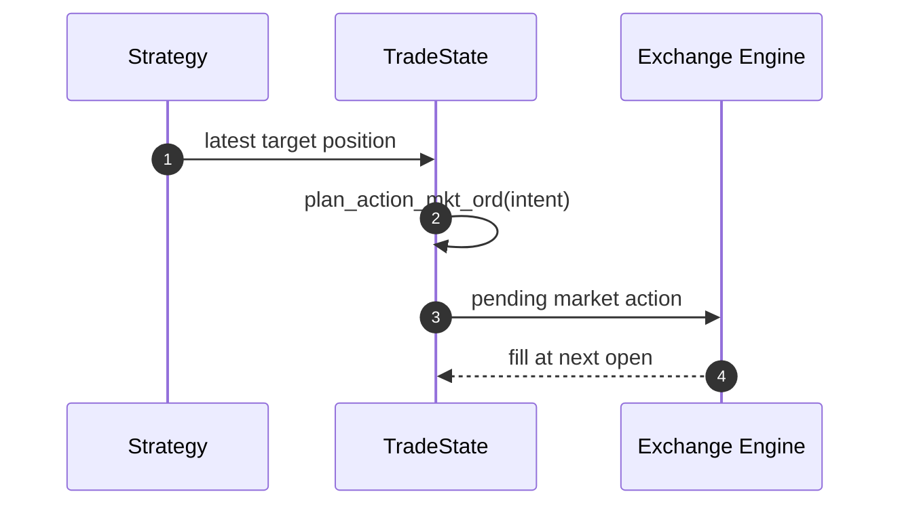
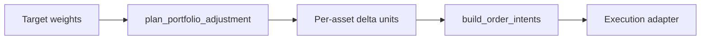
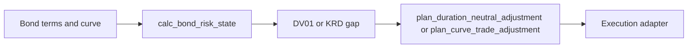
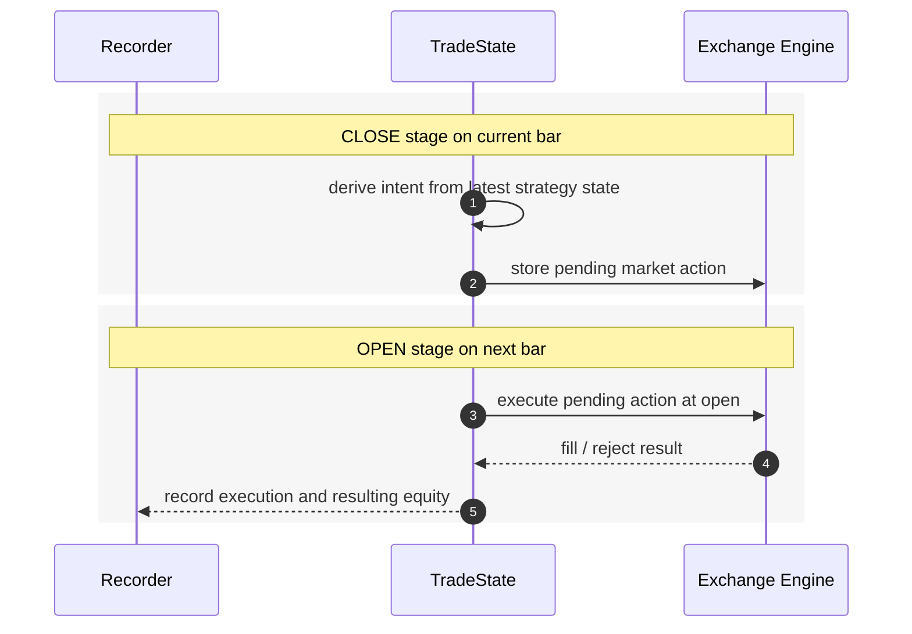

# strategyr Architecture

`strategyr` currently has four layers.

## 1. Feature Layer

This layer computes reusable market-state annotations on candle data and
fixed-income risk descriptors.

Examples:

- `calc_EMA()`
- `calc_ATR()`
- `calc_ATR_quantile()`
- `calc_ladder_index()`
- `calc_bond_duration()`
- `calc_bond_zspread()`

These functions operate mostly on `data.table` inputs for market data, with a
small set of scalar fixed-income calculators for bond and curve state needed by
downstream strategies.

## 2. Strategy Layer

This layer converts features into target positions or rebalance decisions.

Examples:

- `strat_buy_and_hold_tgt_pos()`
- `strat_ema_cross_tgt_pos()`
- `strat_ladder_bounce_tgt_pos()`
- `strat_ladder_breakout_tgt_pos()`
- `plan_portfolio_adjustment()`
- `calc_bond_risk_state()`
- `plan_duration_neutral_adjustment()`
- `plan_curve_trade_adjustment()`

The strategy layer is the public rule layer. It should stay transparent and easy
to test.

## 3. Action Layer

This layer turns targets and current state into executable intents.

Examples:

- `gen_action_plan_rcpp()`
- `strat_*_action_plan()`
- `build_order_intents()`

For single-asset trading, the current path is:

For portfolio workflows, the current minimal path is:

For fixed-income hedge workflows, the current minimal path is:

## 4. Backtest Layer

This layer evaluates path-dependent behavior under execution assumptions.

Core engine:

- `backtest_rcpp()`

Key properties:

- pending actions are executed on the next bar open
- fees and funding affect equity
- liquidation checks are explicit
- recorder output preserves an execution trace

## Execution Timing

The current market-order design is:

The supplied Mermaid notes for limit-order and TP/SL flows are also useful
guides for future expansion, but those mechanics are not yet fully implemented
in the public package.
