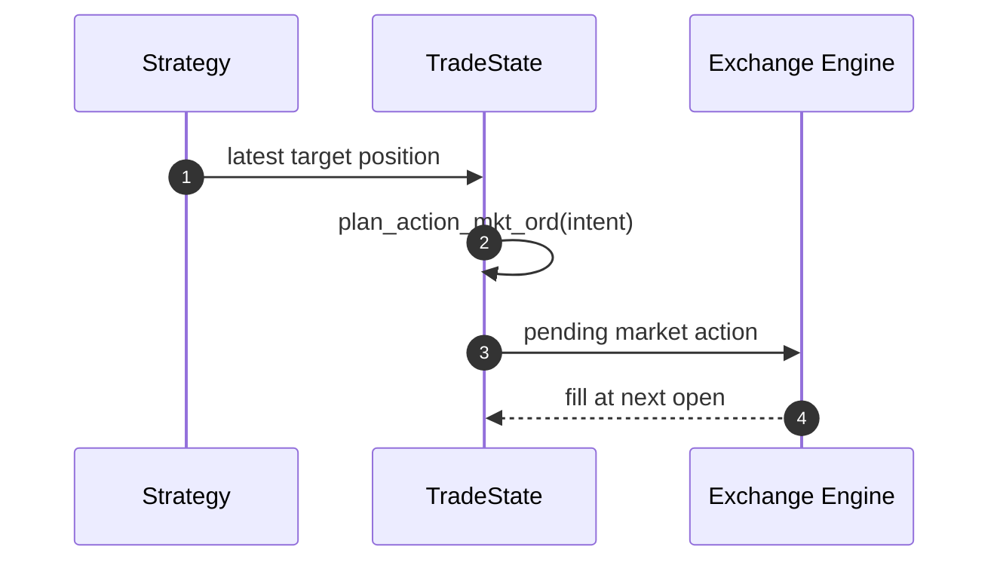
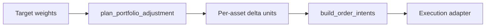
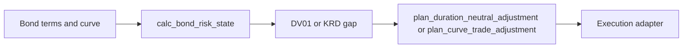
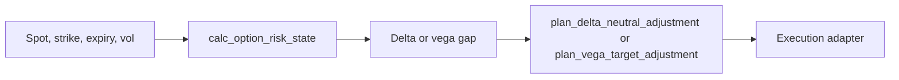
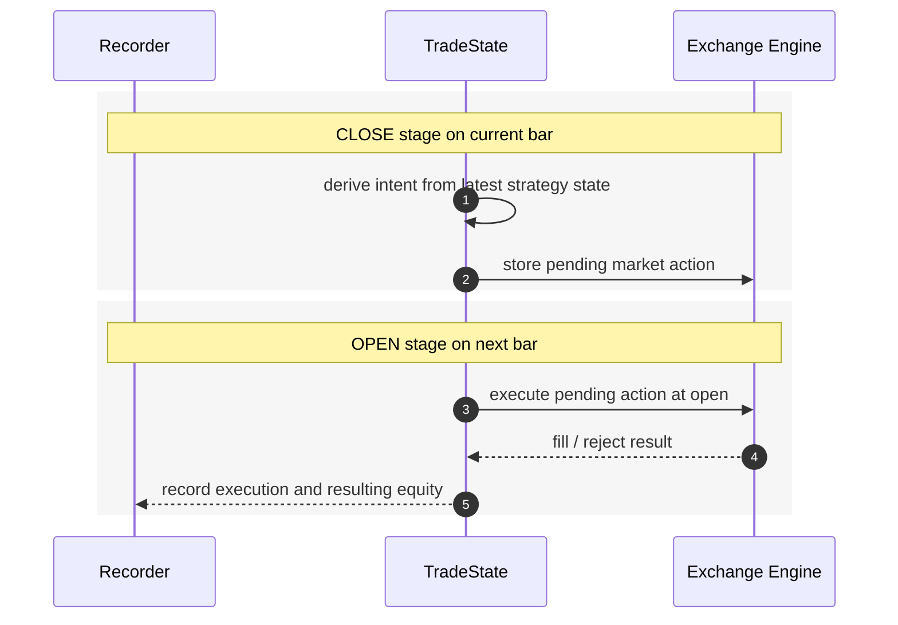

# strategyr Architecture

`strategyr` currently has five layers.

Related contributor note:

- `docs/strategy_design.md` defines the implementation standard for public
  `strat_*` functions.
- `docs/strategy_catalog.md` lists public strategy families by category,
  inputs, output level, and default `strat_id`.
- `docs/api_consistency.md` records current API conventions, intentional
  exceptions, and cleanup targets.
- `docs/ml_rl.md` documents optional experimental LSTM and PPO workflows.

## 1. Feature Layer

This layer computes reusable market-state annotations on candle data, cross-
sectional breadth and relative-value panels, execution-condition descriptors,
and fixed-income, FX, futures, credit, and option risk descriptors.

Examples:

- `calc_EMA()`
- `calc_ATR()`
- `calc_ATR_quantile()`
- `calc_ladder_index()`
- `calc_bond_duration()`
- `calc_bond_zspread()`
- `calc_option_greeks()`
- `calc_option_iv()`
- `calc_breadth_ad()`
- `calc_rolling_beta()`
- `calc_bid_ask_spread()`
- `calc_roll_yield()`
- `calc_fx_carry()`
- `calc_credit_spread()`

These functions operate mostly on `data.table` inputs for market data, with a
small set of scalar fixed-income and option calculators for bond, curve, FX,
and derivative risk state needed by downstream strategies.

## 2. Strategy Layer

This layer converts features into target positions or rebalance decisions.

Examples:

- `strat_buy_and_hold_tgt_pos()`
- `strat_ema_cross_tgt_pos()`
- `strat_macd_cross_tgt_pos()`
- `strat_macd_contrarian_tgt_pos()`
- `strat_bollinger_revert_tgt_pos()`
- `strat_rsi_revert_tgt_pos()`
- `strat_rsi_logr_revert_tgt_pos()`
- `strat_donchian_breakout_tgt_pos()`
- `strat_atr_breakout_tgt_pos()`
- `strat_vol_target_tgt_pos()`
- `strat_trend_pullback_tgt_pos()`
- `strat_pair_spread_revert_tgt_pos()`
- `strat_ratio_revert_tgt_pos()`
- `strat_relative_strength_tgt_pos()`
- `strat_fx_carry_tgt_pos()`
- `strat_bond_carry_roll_tgt_pos()`
- `strat_curve_steepener_tgt_pos()`
- `strat_roll_yield_tgt_pos()`
- `strat_iv_skew_tgt_pos()`
- `strat_iv_term_structure_tgt_pos()`
- `strat_straddle_tgt_pos()`
- `strat_strangle_tgt_pos()`
- `strat_vertical_spread_tgt_pos()`
- `strat_ladder_bounce_tgt_pos()`
- `strat_ladder_breakout_tgt_pos()`
- `plan_portfolio_adjustment()`
- `calc_bond_risk_state()`
- `plan_duration_neutral_adjustment()`
- `plan_curve_trade_adjustment()`
- `calc_option_risk_state()`
- `plan_delta_neutral_adjustment()`
- `plan_vega_target_adjustment()`

The strategy layer is the public rule layer. It should stay transparent and easy
to test.

The contributor standard for this layer is documented in
`docs/strategy_design.md`. The current public strategy surface is cataloged in
`docs/strategy_catalog.md`, and API consistency notes are maintained in
`docs/api_consistency.md`.

## 3. Action Layer

This layer turns targets and current state into executable intents.

Examples:

- `gen_action_plan_rcpp()`
- `strat_*_action_plan()`
- `build_order_intents()`

For single-asset trading, the current path is:

For portfolio workflows, the current minimal path is:

For portfolio backtesting, the current minimal path is:

For fixed-income hedge workflows, the current minimal path is:

For option hedge workflows, the current minimal path is:

## 4. Backtest Layer

This layer evaluates path-dependent behavior under execution assumptions.

Core engine:

- `backtest_rcpp()`
- `backtest_portfolio_weights()`

Key properties:

- pending actions are executed on the next bar open
- fees and funding affect equity
- liquidation checks are explicit
- recorder output preserves an execution trace
- portfolio-weight paths can be evaluated with open-price rebalancing,
  transaction fees, and close-price mark-to-market

## 5. Strategy Mining Layer

This layer loops strategy parameters or tradable assets across a fixed
backtesting setup and ranks results by a performance metric.

Examples:

- `calc_backtest_performance()`
- `mine_strategy_params()`
- `mine_strategy_assets()`
- `mine_strategy_asset_years()`
- `mine_strategy_walk_forward()`
- `select_strategy_params()`
- `summarize_walk_forward_results()`
- `filter_walk_forward_results()`

The default ranking metric is Sortino ratio, computed inside `strategyr` from
the backtest equity curve. The mining layer is deliberately data-provider
agnostic: callers supply the fixed market data table or a named list of market
data tables, and the mining helpers reuse the same `strat_*_tgt_pos()` rule and
`backtest_rcpp()` execution assumptions used elsewhere in the package.

Mining outputs are intentionally plain `data.table`s or lists of tables. The
selection helper extracts reusable parameter rows for the next run, while the
walk-forward summary helper reports out-of-sample score stability, train/test
score decay, and insufficient-warmup counts. The filter helper applies simple
anti-overfit gates such as minimum out-of-sample windows, positive-window rate,
maximum train/test score decay, and warmup-quality thresholds.

## Optional ML/RL Layer

Experimental ML/RL helpers sit beside the feature and strategy layers rather
than replacing them. `calc_lstm_forecast()` may create a forecast column with
optional `torch`, and `strat_lstm_forecast_tgt_pos()` converts that forecast
into a standard target-position vector. `train_ppo_policy_py()` is a
`reticulate` adapter for Python `stable-baselines3`, while
`strat_ppo_policy_tgt_pos()` maps PPO actions into target positions.

The boundary is explicit: model training and inference may be external or
optional, but strategy outputs must remain compatible with `backtest_rcpp()`,
`backtest_portfolio_weights()`, `.action_plan_from_tgt_pos()`, and portfolio
target-weight workflows. See `docs/ml_rl.md` for the dependency and design
rules.

## Native Strategy Kernels

High-value path-dependent signal loops should move to Rcpp when profiling or
repeated mining use shows that R loop overhead matters. The current native
strategy kernels cover buy-and-hold, RSI reversion, Donchian Turtle, ATR
trailing stop, pair-spread reversion, and RSI divergence. The R wrappers remain
the public API and still own feature construction, documentation, testing, and
action-plan integration.

The portfolio backtest has a native accounting core for the standard
target-weight path. The R wrapper remains authoritative while the API is still
evolving; position-path reporting currently stays in R for readability.

## Execution Timing

The current market-order design is:

The supplied Mermaid notes for limit-order and TP/SL flows are also useful
guides for future expansion, but those mechanics are not yet fully implemented
in the public package.
